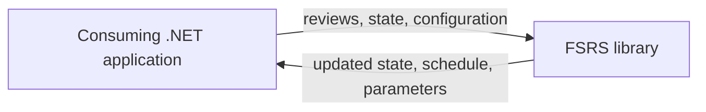
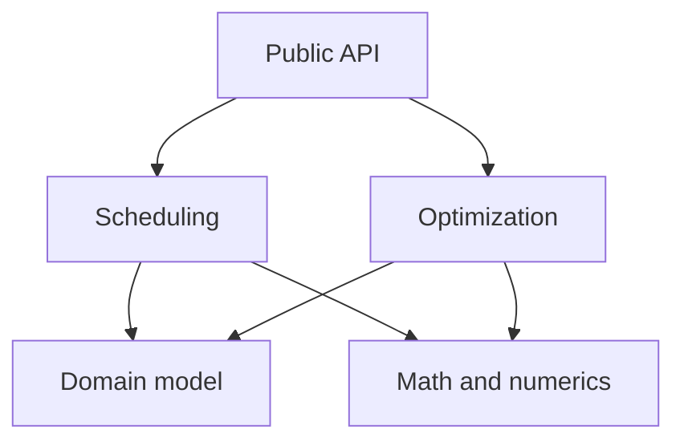
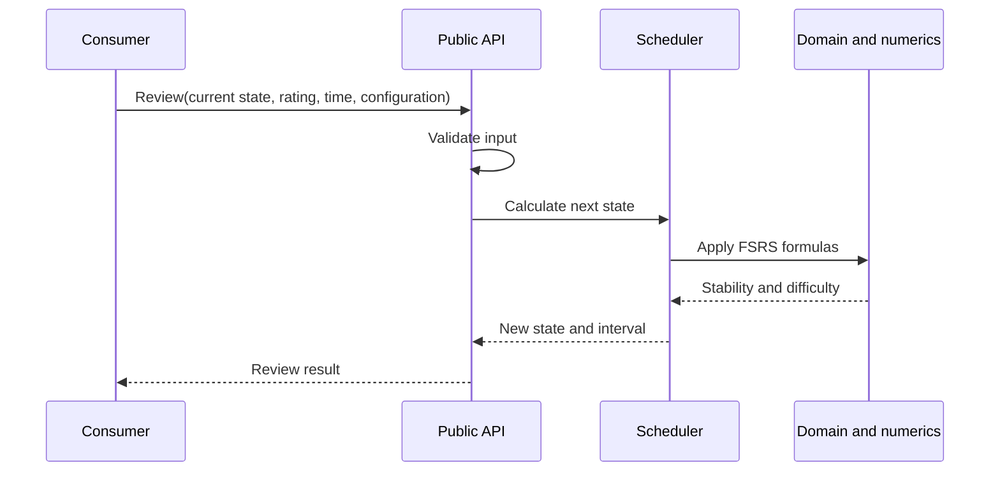
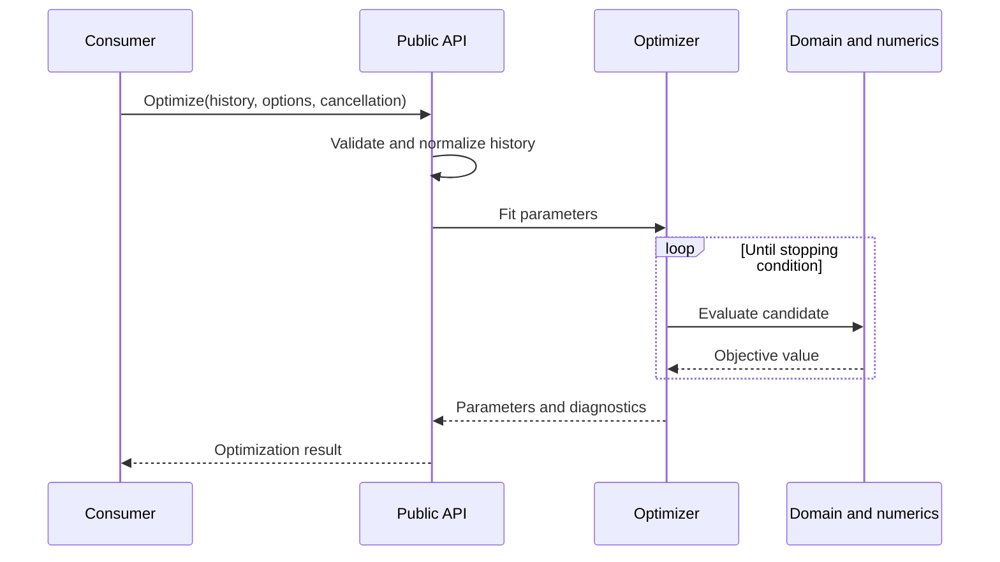

# Architecture

This document records the durable architectural direction for the project. It follows the useful parts of arc42 while intentionally omitting detail that is better expressed by code, tests, or individual architectural decision records (ADRs).

## 1. Introduction and Goals

The project provides a native C# implementation of the Free Spaced Repetition Scheduler (FSRS) for the .NET runtime. It will support both review scheduling and parameter optimization without embedding Python, calling native binaries, or depending on a separate service.

The implementation should remain behaviorally compatible with the supported FSRS specification and trusted reference implementations, while presenting an idiomatic .NET API rather than a line-by-line port.

### Quality goals

| Priority | Goal | Meaning |
| --- | --- | --- |
| 1 | Correctness | Scheduling and optimization conform to the supported FSRS behavior within documented numerical tolerances. |
| 2 | Usability | Common workflows require little ceremony; advanced behavior remains explicit and discoverable. |
| 3 | Maintainability | Mathematics, domain policy, optimization, and API concerns remain understandable and independently testable. |
| 4 | Reliability | Inputs, time, numerical edge cases, cancellation, and determinism are handled deliberately. |
| 5 | Performance | Scheduling is inexpensive and optimization is practical for real review histories, based on benchmarks rather than assumptions. |

### Scope

The library owns:

- FSRS domain concepts and configuration.
- Memory-state calculations and review scheduling.
- Parameter fitting from review histories.
- Validation, compatibility tests, and a supported public API.

It does not own application UI, persistence, synchronization, authentication, analytics, or hosting.

## 2. Context and Scope

The system is an in-process library. A consuming .NET application supplies review data and configuration, calls the public API, and decides how to store or present the results. The library performs no network, database, filesystem, or clock access unless a future decision explicitly introduces it.

The public API is the system boundary. Data ownership remains with the consuming application.

## 3. Solution Strategy

- **Platform:** Modern C# and .NET, distributed as one or more NuGet packages. Exact target frameworks are decided by ADR.
- **Architecture:** Apply Clean Architecture and Clean Code principles proportionately. Domain rules and mathematics remain independent of delivery mechanisms and frameworks; dependencies point toward stable domain concepts.
- **Design style:** Prefer a small functional core with explicit inputs and outputs. Avoid hidden global state and unnecessary interfaces, layers, or dependency injection.
- **Correctness:** Use trusted FSRS implementations, published formulas, fixed test vectors, invariants, and regression cases as complementary evidence.
- **Development:** Use test-driven development for new behavior where practical. Keep tests fast and deterministic, then add broader compatibility and benchmark suites.
- **Numerics:** Make precision, bounds, randomness, seeding, convergence, and tolerances explicit. Optimizer work must support cancellation.
- **API evolution:** Keep the public surface narrow, follow semantic versioning, and document intentional behavioral differences.
- **Performance:** Establish benchmarks before optimizing. Prefer clarity until measurement identifies a meaningful bottleneck.

## 4. Building Block View

The initial design needs only a few conceptual building blocks. These are responsibility boundaries, not necessarily separate projects or assemblies.

| Building block | Responsibility |
| --- | --- |
| Public API | Stable entry points, input validation, result types, and translation between consumer-facing and internal representations. |
| Scheduling | Apply FSRS rules to review events and produce updated memory state and intervals. |
| Optimization | Prepare review histories, evaluate candidate parameters, and fit parameters using an explicit objective. |
| Domain model | Represent cards, review events, ratings, memory state, parameters, and constraints without infrastructure concerns. |
| Math and numerics | Small, testable formulas and numerical utilities shared by scheduling and optimization. |

Package and assembly boundaries should emerge from demonstrated needs. The code should not imitate a distributed system inside a single library.

## 5. Runtime View

### Schedule a review

### Optimize parameters

These flows express intent only. Internal call shapes may change without requiring an architectural update.

## 6. Architectural Decisions

Long-lived or costly decisions belong in `docs/adr/`. Use an ADR when a choice affects public compatibility, package or module boundaries, numerical behavior, supported platforms, major dependencies, testing strategy, or contributor workflow.

Use sequential filenames such as `0001-record-architecture-decisions.md`. Each ADR should contain:

- Title and status: Proposed, Accepted, Superseded, or Rejected.
- Context and decision drivers.
- Decision.
- Consequences and tradeoffs.
- Superseding ADR, when applicable.

ADRs record why a decision was made; this document summarizes only the current architecture. Supersede old ADRs rather than rewriting their history.

Likely early ADRs include the supported FSRS version, target frameworks, package layout, optimizer baseline, floating-point tolerances, randomness policy, and licensing.

## 7. Glossary

| Term | Meaning |
| --- | --- |
| FSRS | Free Spaced Repetition Scheduler, a family of models and algorithms for estimating memory and scheduling reviews. |
| Review | A learner response that updates memory state and influences the next interval. |
| Rating | The outcome supplied for a review, represented by the supported FSRS rating scale. |
| Memory state | The model's current estimate of a learner's memory for an item, principally stability and difficulty. |
| Stability | The time associated with a defined probability of recall under the supported FSRS model. |
| Difficulty | The model's estimate of how difficult an item is for the learner. |
| Retrievability | The estimated probability that the learner can recall an item at a given time. |
| Parameters | Numerical weights controlling FSRS behavior. |
| Scheduler | The component that updates memory state and chooses the next review interval. |
| Optimizer | The component that estimates parameters from historical reviews. |
| Compatibility test | A test comparing behavior with an accepted specification, vector set, or reference implementation. |
| ADR | Architectural Decision Record: a short, immutable record of an important decision and its consequences. |
